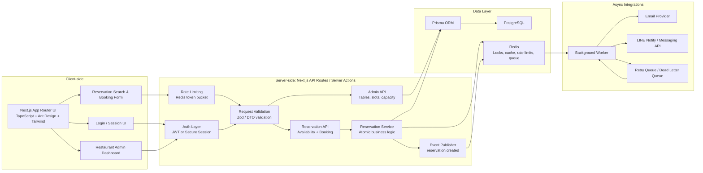

# System Architecture Specification

**File Name:** `Ton-Ekkachai.c-spec.md`

## Mermaid System Diagram



## Technology Stack

- **Frontend:** Next.js App Router, TypeScript, Ant Design, Tailwind CSS
- **Backend:** Next.js API Routes or Server Actions
- **Database:** PostgreSQL via Prisma
- **Cache / Locking / Queue:** Redis
- **Notifications:** LINE Messaging API or LINE Notify, email provider
- **Authentication:** JWT or secure cookie-based sessions

## Core Components

### Client Layer

The client is a Next.js App Router application using Ant Design for complex UI components and Tailwind CSS for layout and styling.

Primary screens include:

- Customer reservation search
- Reservation creation form
- User reservation history
- Admin table management
- Admin reservation calendar
- Admin cancellation and manual override tools

### Server Layer

The server layer owns all business rules. The client should never decide whether a table is truly available.

Main API areas include:

- `POST /api/reservations/check-availability`
- `POST /api/reservations`
- `GET /api/reservations/:id`
- `PATCH /api/reservations/:id/cancel`
- `GET /api/admin/reservations`
- `POST /api/admin/tables`
- `PATCH /api/admin/tables/:id`

Each request passes through:

1. Authentication where required
2. Rate limiting
3. Input validation
4. Authorization
5. Business logic service
6. Database transaction
7. Async event publishing

### Data Layer

PostgreSQL is the source of truth.

Redis is used for:

- API rate limiting
- Short-lived distributed locks
- Caching availability lookups
- Background job queue
- Retry scheduling

## Suggested Data Model

Important tables include users, restaurant tables, and reservations.

```prisma
model User {
  id        String   @id @default(uuid())
  email     String   @unique
  name      String?
  phone     String?
  createdAt DateTime @default(now())

  reservations Reservation[]
}

model RestaurantTable {
  id        String   @id @default(uuid())
  name      String
  capacity  Int
  isActive  Boolean  @default(true)

  reservations Reservation[]
}

model Reservation {
  id              String   @id @default(uuid())
  userId          String?
  tableId         String
  guestName       String
  guestEmail      String?
  guestPhone      String?
  partySize       Int
  reservationTime DateTime
  durationMinutes Int      @default(90)
  status          ReservationStatus @default(CONFIRMED)
  createdAt       DateTime @default(now())
  updatedAt       DateTime @updatedAt

  user  User?            @relation(fields: [userId], references: [id])
  table RestaurantTable  @relation(fields: [tableId], references: [id])

  @@index([reservationTime])
  @@index([tableId, reservationTime])
  @@index([status, reservationTime])
}

enum ReservationStatus {
  PENDING
  CONFIRMED
  CANCELLED
  NO_SHOW
  COMPLETED
}
```

## Concurrency Handling

The dangerous case is two users booking the same table for the same time slot at nearly the same moment.

Do not rely on frontend availability checks. Availability checks are only advisory.

The final booking must happen atomically on the server.

### Option A: PostgreSQL Transaction

Use a database transaction with row-level locking.

Flow:

1. Start transaction.
2. Find eligible table.
3. Lock relevant table or reservation rows using `SELECT ... FOR UPDATE`.
4. Re-check overlapping reservations inside the transaction.
5. Insert reservation.
6. Commit transaction.

Example logic:

```typescript
await prisma.$transaction(async (tx) => {
  const table = await tx.$queryRaw`
    SELECT *
    FROM "RestaurantTable"
    WHERE id = ${tableId}
    FOR UPDATE
  `;

  const conflict = await tx.reservation.findFirst({
    where: {
      tableId,
      status: "CONFIRMED",
      reservationTime: {
        lt: requestedEndTime,
      },
      // Also check existing reservation end time > requestedStartTime.
    },
  });

  if (conflict) {
    throw new Error("Table is no longer available");
  }

  return tx.reservation.create({
    data: reservationData,
  });
});
```

### Option B: Redis Distributed Lock

Use Redis to lock a specific booking resource before writing.

Lock key example:

```text
reservation-lock:{restaurantId}:{tableId}:{reservationDateTime}
```

Flow:

1. Acquire Redis lock with short TTL.
2. If lock acquisition fails, return `409 Conflict` or retry briefly.
3. Inside the lock, run database transaction.
4. Re-check availability.
5. Insert reservation.
6. Release lock.

Best practice: even when Redis locking is used, still use a database transaction. Redis reduces contention, but PostgreSQL remains the source of truth.

## Lifecycle

### Step 1: Request

The customer submits:

- Date
- Time
- Party size
- Name
- Phone or email
- Optional user account ID

### Step 2: Validation

Server validates:

- Required fields
- Valid reservation time
- Party size limits
- Restaurant opening hours
- Lead time rules
- Cancellation and duplicate booking rules
- Table capacity rules

Use a schema validator such as Zod.

### Step 3: Availability Check

The service queries available tables based on:

- Table capacity
- Reservation duration
- Existing confirmed reservations
- Restaurant operating hours
- Admin blocks or holidays

### Step 4: Atomic Write

The server creates the reservation inside a transaction.

Critical behavior:

- Re-check availability inside the transaction.
- Prevent overlapping confirmed reservations.
- Insert reservation as `CONFIRMED` or `PENDING`.
- Commit the transaction.

### Step 5: Publish Integration Event

After the database commit succeeds, publish an event:

```text
reservation.created
```

Payload:

```json
{
  "reservationId": "res_123",
  "guestName": "Jane Doe",
  "reservationTime": "2026-05-20T19:00:00.000Z",
  "partySize": 4,
  "tableId": "tbl_1"
}
```

### Step 6: Async Notification

A background worker consumes the event and sends:

- Confirmation email
- LINE notification to restaurant
- Optional customer reminder

### Step 7: Confirmation Response

The API responds immediately after the reservation is safely committed.

The user does not need to wait for LINE or email delivery.

## External Failure Strategy

External integrations should not run directly inside the database transaction.

Bad pattern:

```text
Create reservation -> Send LINE -> Send email -> Commit DB
```

This couples booking success to third-party availability.

Better pattern:

```text
Create reservation -> Commit DB -> Publish event -> Async worker sends notifications
```

If LINE or email fails:

- Retry with exponential backoff.
- Store delivery attempts.
- Move permanently failed jobs to a dead letter queue.
- Show notification status in admin tools.
- Never delete or roll back a valid reservation because LINE is down.

Recommended Redis queue strategy:

- BullMQ or similar Redis-backed queue
- Retry count: 5
- Backoff: exponential
- Dead letter queue for manual inspection

## Security

### Authentication

For customers:

- Secure HTTP-only cookie session, or JWT stored in HTTP-only cookies
- Avoid localStorage for sensitive auth tokens

For admins:

- Role-based access control
- Admin-only route protection
- Optional MFA for production admin panel

### Authorization

Every admin API route must verify:

- User is authenticated
- User has admin or restaurant-manager role
- User has access to the specific restaurant or location

### Rate Limiting

Use Redis token bucket or sliding window rate limiting.

Examples:

- Reservation creation: strict limit per IP and user
- Availability search: moderate limit
- Login: strict limit with temporary lockout
- Admin APIs: authenticated user-based limits

## Performance

### Database Indexing

Important indexes:

```sql
CREATE INDEX reservation_time_idx
ON "Reservation" ("reservationTime");

CREATE INDEX reservation_table_time_idx
ON "Reservation" ("tableId", "reservationTime");

CREATE INDEX reservation_status_time_idx
ON "Reservation" ("status", "reservationTime");
```

For overlap queries, consider:

- Composite indexes on `tableId`, `status`, `reservationTime`
- PostgreSQL range types for reservation windows
- Exclusion constraints if modeling time ranges explicitly

### Caching

Cache read-heavy availability data carefully.

Good candidates:

- Restaurant opening hours
- Table metadata
- Static configuration
- Availability snapshots with very short TTL

Do not trust cached availability during final booking. Always re-check inside the transaction.

### Observability

Use structured logging around:

- Reservation creation
- Transaction conflicts
- Lock acquisition failures
- Notification failures
- Admin overrides

Track metrics:

- Booking success rate
- Conflict rate
- API latency
- Queue depth
- Notification failure rate
- Database transaction duration

## Production Principle

PostgreSQL owns truth, Redis improves coordination and throughput, and external integrations are asynchronous side effects after the reservation is safely committed.

# Database Schema Specification

**File Name:** `Ton-Ekkachai.c-spec.md`

## Prisma Schema

```prisma
generator client {
  provider = "prisma-client-js"
}

datasource db {
  provider = "postgresql"
  url      = env("DATABASE_URL")
}

enum UserRole {
  ADMIN
  CUSTOMER
}

enum ReservationStatus {
  PENDING
  CONFIRMED
  CANCELLED
  NO_SHOW
}

model User {
  id        String   @id @default(uuid()) @db.Uuid
  email     String   @unique @db.VarChar(255)
  name      String   @db.VarChar(120)
  phone     String?  @db.VarChar(32)
  role      UserRole @default(CUSTOMER)
  isActive  Boolean  @default(true)

  reservations Reservation[]

  createdAt DateTime @default(now())
  updatedAt DateTime @updatedAt

  @@index([role])
  @@index([isActive])
  @@map("users")
}

model RestaurantTable {
  id          String  @id @default(uuid()) @db.Uuid
  name        String  @db.VarChar(80)
  capacity    Int
  location    String? @db.VarChar(120)
  description String? @db.Text
  isActive    Boolean @default(true)

  reservations Reservation[]

  createdAt DateTime @default(now())
  updatedAt DateTime @updatedAt

  @@index([capacity])
  @@index([isActive])
  @@map("restaurant_tables")
}

model Reservation {
  id              String            @id @default(uuid()) @db.Uuid
  userId          String?           @db.Uuid
  tableId         String            @db.Uuid
  guestName       String            @db.VarChar(120)
  guestEmail      String?           @db.VarChar(255)
  guestPhone      String?           @db.VarChar(32)
  partySize       Int
  reservationTime DateTime
  durationMinutes Int               @default(90)
  status          ReservationStatus @default(PENDING)
  notes           String?           @db.Text
  cancelledAt     DateTime?
  noShowAt        DateTime?

  user  User?            @relation(fields: [userId], references: [id], onDelete: SetNull, onUpdate: Cascade)
  table RestaurantTable  @relation(fields: [tableId], references: [id], onDelete: Restrict, onUpdate: Cascade)

  createdAt DateTime @default(now())
  updatedAt DateTime @updatedAt

  @@index([userId])
  @@index([tableId])
  @@index([reservationTime])
  @@index([status])
  @@index([status, reservationTime])
  @@index([tableId, reservationTime])
  @@index([tableId, status, reservationTime])

  // This prevents exact-slot double booking for the same table.
  // For overlapping reservation windows, enforce conflict checks inside a database transaction
  // or use PostgreSQL exclusion constraints in a custom migration.
  @@unique([tableId, reservationTime])

  @@map("reservations")
}
```

## Relationship Design

- `User -> Reservation` is a one-to-many relationship.
- A user can have many reservations through `User.reservations`.
- `Reservation.userId` is optional to support guest checkout reservations.
- If a user account is deleted, `Reservation.userId` is set to `NULL` using `onDelete: SetNull`.
- This preserves historical reservation records for audit and reporting.

- `RestaurantTable -> Reservation` is a one-to-many relationship.
- A restaurant table can have many reservations across different time slots.
- `Reservation.tableId` is required because every reservation must be assigned to a table.
- `onDelete: Restrict` prevents deleting a table that has historical reservations.
- Tables should generally be deactivated with `isActive = false` instead of deleted.

- UUID primary keys are used for all core entities.
- UUIDs are safer for public-facing APIs because they are harder to enumerate than sequential integer IDs.

## Field Design

- `createdAt` and `updatedAt` are included on every core model for auditability.
- `User.role` uses `UserRole` to separate admin users from customer users.
- `Reservation.status` uses `ReservationStatus` to model the reservation lifecycle.
- `Reservation.cancelledAt` and `Reservation.noShowAt` provide explicit lifecycle timestamps.
- `Reservation.durationMinutes` supports variable booking lengths.
- `RestaurantTable.capacity` supports table matching based on party size.
- `RestaurantTable.isActive` allows tables to be removed from future availability without deleting historical data.
- `User.isActive` allows account suspension without losing reservation history.

## Indexing Strategy

- `@@index([userId])` optimizes fetching a customer's reservation history.
- `@@index([tableId])` optimizes table-specific reservation queries.
- `@@index([reservationTime])` optimizes calendar and time-window lookups.
- `@@index([status])` optimizes filtering by reservation lifecycle state.
- `@@index([status, reservationTime])` optimizes admin dashboards that list upcoming confirmed or pending reservations.
- `@@index([tableId, reservationTime])` optimizes availability checks for a specific table and time.
- `@@index([tableId, status, reservationTime])` optimizes conflict checks for active reservations on a table.
- `@@index([capacity])` helps find tables that can fit a requested party size.
- `@@index([isActive])` helps filter active users and active restaurant tables.

## Double-Booking Prevention Strategy

- `@@unique([tableId, reservationTime])` prevents exact duplicate bookings for the same table at the same start time.
- This is useful when reservations are slot-based, for example every 30, 60, or 90 minutes.
- Exact unique constraints do not fully prevent overlapping reservations with different start times.
- For example, a 7:00 PM to 8:30 PM reservation and a 7:30 PM to 9:00 PM reservation would not be blocked by `@@unique([tableId, reservationTime])`.
- To prevent overlapping bookings in production, the application should re-check availability inside a database transaction before creating a reservation.
- For stronger database-level protection, use a PostgreSQL exclusion constraint with time ranges in a custom migration.
- Redis distributed locks may also be used to reduce race conditions, but PostgreSQL transactions remain the final source of truth.

## Production Notes

- Use soft deactivation for users and tables instead of destructive deletes.
- Keep historical reservation records for audit, analytics, dispute resolution, and customer service.
- Perform all reservation creation logic inside a transaction.
- Never trust frontend availability checks during final booking.
- Always re-check reservation conflicts on the server immediately before writing the reservation.

## Tech Stack & Justification

| Technology                                 | Reason for Selection                                                                                                                                                                |
| ------------------------------------------ | ----------------------------------------------------------------------------------------------------------------------------------------------------------------------------------- |
| Frontend: Next.js App Router + TypeScript  | Supports SEO for public restaurant pages while enabling fast development of admin dashboards with strong type safety.                                                               |
| UI Library: Ant Design + Tailwind CSS      | Ant Design provides robust Table, Calendar, DatePicker, and Form components for reservation workflows, while Tailwind CSS gives precise control over layout and responsive styling. |
| Backend: Next.js API Routes / Serverless   | Reduces operational complexity by keeping frontend and backend in one TypeScript codebase, while supporting scalable serverless deployment patterns.                                |
| Database: PostgreSQL via Supabase / Prisma | Provides strong relational data modeling, ACID transactions, and consistency guarantees required to prevent duplicate or conflicting reservations.                                  |
| Cache: Redis                               | Supports real-time reservation workflows through short-lived locks, rate limiting, caching, and queue-backed background processing.                                                 |

## API Specification

### API Design Principles

- All API routes are implemented through Next.js App Router route handlers under `/api`.
- All request payloads are validated server-side before business logic is executed.
- Authenticated customer routes require a secure HTTP-only session cookie or bearer token.
- Admin routes require both authentication and role-based authorization.
- Reservation creation must perform final availability validation inside an atomic database transaction.
- External notifications are emitted asynchronously after the reservation is committed.

### Shared TypeScript Types

```typescript
type ReservationStatus = "PENDING" | "CONFIRMED" | "CANCELLED" | "NO_SHOW";

type ApiErrorCode =
  | "VALIDATION_ERROR"
  | "UNAUTHORIZED"
  | "FORBIDDEN"
  | "NOT_FOUND"
  | "CONFLICT"
  | "RATE_LIMITED"
  | "INTERNAL_ERROR";

interface ApiErrorResponse {
  success: false;
  error: {
    code: ApiErrorCode;
    message: string;
    details?: Record<string, unknown>;
  };
}

interface ReservationDto {
  id: string;
  userId?: string | null;
  tableId: string;
  guestName: string;
  guestEmail?: string | null;
  guestPhone?: string | null;
  partySize: number;
  reservationTime: string;
  durationMinutes: number;
  status: ReservationStatus;
  notes?: string | null;
  createdAt: string;
  updatedAt: string;
}
```

### Endpoint Summary

| Endpoint | Method | Auth | Primary Use Case |
|---|---:|---|---|
| `/api/reservations/check-availability` | `POST` | Optional | Search available tables for a date, time, and party size. |
| `/api/reservations` | `POST` | Optional customer session | Create a reservation using atomic conflict prevention. |
| `/api/users/me/reservations` | `GET` | Required | Fetch the current user's reservation history. |
| `/api/reservations/:reservationId` | `PATCH` | Required or verified guest token | Update reservation details or cancel an existing reservation. |
| `/api/admin/dashboard/summary` | `GET` | Required admin role | Fetch operational metrics for the admin dashboard. |

### Check Availability

| Field | Specification |
|---|---|
| Method & Path | `POST /api/reservations/check-availability` |
| Description | Returns available tables and candidate time slots for a requested party size and reservation window. This endpoint is advisory only; final availability must be rechecked during reservation creation. |
| Request Headers | `Content-Type: application/json`; optional `Authorization: Bearer <token>` or secure session cookie. |
| Request Body | See `CheckAvailabilityRequest`. |
| Success Response | `200 OK` with `CheckAvailabilitySuccessResponse`. |
| Error Responses | `400 VALIDATION_ERROR`, `429 RATE_LIMITED`, `500 INTERNAL_ERROR`. |

```typescript
interface CheckAvailabilityRequest {
  partySize: number;
  reservationTime: string;
  durationMinutes?: number;
}

interface AvailableTableOption {
  tableId: string;
  tableName: string;
  capacity: number;
  reservationTime: string;
  durationMinutes: number;
}

interface CheckAvailabilitySuccessResponse {
  success: true;
  data: {
    requestedTime: string;
    partySize: number;
    available: boolean;
    options: AvailableTableOption[];
  };
}
```

### Create Reservation

| Field | Specification |
|---|---|
| Method & Path | `POST /api/reservations` |
| Description | Creates a reservation after validating business rules, acquiring a short-lived lock when configured, and writing the reservation inside a database transaction. |
| Request Headers | `Content-Type: application/json`; optional `Authorization: Bearer <token>` or secure session cookie for logged-in users; `Idempotency-Key` recommended for retry-safe clients. |
| Request Body | See `CreateReservationRequest`. |
| Success Response | `201 Created` with `CreateReservationSuccessResponse`. |
| Error Responses | `400 VALIDATION_ERROR`, `401 UNAUTHORIZED` when user-only booking is required, `409 CONFLICT` when the table or time slot is unavailable, `429 RATE_LIMITED`, `500 INTERNAL_ERROR`. |

```typescript
interface CreateReservationRequest {
  tableId?: string;
  partySize: number;
  reservationTime: string;
  durationMinutes?: number;
  guestName: string;
  guestEmail?: string;
  guestPhone?: string;
  notes?: string;
}

interface CreateReservationSuccessResponse {
  success: true;
  data: {
    reservation: ReservationDto;
    notificationStatus: "QUEUED" | "SKIPPED";
  };
}
```

### Get User Reservations

| Field | Specification |
|---|---|
| Method & Path | `GET /api/users/me/reservations` |
| Description | Returns paginated reservations for the authenticated customer. Supports filtering by status and time range. |
| Request Headers | `Authorization: Bearer <token>` or secure session cookie. |
| Query Parameters | `status?: ReservationStatus`, `from?: string`, `to?: string`, `page?: number`, `pageSize?: number`. |
| Success Response | `200 OK` with `GetUserReservationsSuccessResponse`. |
| Error Responses | `401 UNAUTHORIZED`, `429 RATE_LIMITED`, `500 INTERNAL_ERROR`. |

```typescript
interface GetUserReservationsQuery {
  status?: ReservationStatus;
  from?: string;
  to?: string;
  page?: number;
  pageSize?: number;
}

interface GetUserReservationsSuccessResponse {
  success: true;
  data: {
    reservations: ReservationDto[];
    pagination: {
      page: number;
      pageSize: number;
      total: number;
      totalPages: number;
    };
  };
}
```

### Cancel or Update Reservation

| Field | Specification |
|---|---|
| Method & Path | `PATCH /api/reservations/:reservationId` |
| Description | Updates reservation details, changes the reservation time, or cancels the reservation. Time and table changes require the same conflict checks as reservation creation. |
| Request Headers | `Content-Type: application/json`; `Authorization: Bearer <token>` or secure session cookie. Guest reservations may alternatively use a signed reservation-management token. |
| Request Body | See `UpdateReservationRequest`. |
| Success Response | `200 OK` with `UpdateReservationSuccessResponse`. |
| Error Responses | `400 VALIDATION_ERROR`, `401 UNAUTHORIZED`, `403 FORBIDDEN`, `404 NOT_FOUND`, `409 CONFLICT`, `429 RATE_LIMITED`, `500 INTERNAL_ERROR`. |

```typescript
interface UpdateReservationRequest {
  reservationTime?: string;
  durationMinutes?: number;
  partySize?: number;
  tableId?: string;
  guestName?: string;
  guestEmail?: string;
  guestPhone?: string;
  notes?: string;
  status?: Extract<ReservationStatus, "CANCELLED">;
  cancellationReason?: string;
}

interface UpdateReservationSuccessResponse {
  success: true;
  data: {
    reservation: ReservationDto;
    notificationStatus: "QUEUED" | "SKIPPED";
  };
}
```

### Admin Dashboard Summary

| Field | Specification |
|---|---|
| Method & Path | `GET /api/admin/dashboard/summary` |
| Description | Returns operational reservation metrics for a date range, including booking counts, cancellations, no-shows, and table utilization. |
| Request Headers | `Authorization: Bearer <token>` or secure admin session cookie. |
| Query Parameters | `from: string`, `to: string`, optional `timezone?: string`. |
| Success Response | `200 OK` with `AdminDashboardSummarySuccessResponse`. |
| Error Responses | `401 UNAUTHORIZED`, `403 FORBIDDEN`, `429 RATE_LIMITED`, `500 INTERNAL_ERROR`. |

```typescript
interface AdminDashboardSummaryQuery {
  from: string;
  to: string;
  timezone?: string;
}

interface AdminDashboardSummarySuccessResponse {
  success: true;
  data: {
    range: {
      from: string;
      to: string;
      timezone: string;
    };
    totals: {
      reservations: number;
      confirmed: number;
      pending: number;
      cancelled: number;
      noShow: number;
      guests: number;
    };
    tableUtilization: Array<{
      tableId: string;
      tableName: string;
      capacity: number;
      bookedSlots: number;
      utilizationRate: number;
    }>;
    upcomingReservations: ReservationDto[];
  };
}
```

## Edge Cases & Risks

### 1. Concurrent Booking for the Same Table

- **Risk:** Two users can pass the availability check and submit a reservation for the same table and time before either request commits.
  - **Mitigation:** Treat availability checks as advisory and perform final conflict validation inside a PostgreSQL transaction.
  - **Mitigation:** Use row-level locking with `SELECT ... FOR UPDATE` on the target table or relevant reservation records.
  - **Mitigation:** Add a Redis short-lived lock keyed by `restaurantId`, `tableId`, and normalized time slot to reduce contention before entering the database transaction.
  - **Mitigation:** Return `409 CONFLICT` when the slot becomes unavailable and prompt the client to refresh available options.

### 2. Overlapping Reservation Windows

- **Risk:** A unique constraint on `tableId + reservationTime` blocks exact duplicates but does not block partially overlapping windows, such as `19:00-20:30` and `19:30-21:00`.
  - **Mitigation:** Query for interval overlap during create and update operations using `existingStart < requestedEnd` and `existingEnd > requestedStart`.
  - **Mitigation:** Store `durationMinutes` consistently and compute the requested end time server-side.
  - **Mitigation:** For stricter database enforcement, add a PostgreSQL exclusion constraint using range types in a custom migration.

### 3. External Notification Failure

- **Risk:** LINE or email provider outages can delay or fail confirmations after a reservation is created.
  - **Mitigation:** Never call external providers inside the reservation database transaction.
  - **Mitigation:** Commit the reservation first, then publish a `reservation.created`, `reservation.updated`, or `reservation.cancelled` event to a Redis-backed queue.
  - **Mitigation:** Retry notification jobs with exponential backoff and move exhausted jobs to a dead letter queue.
  - **Mitigation:** Store notification delivery status separately so staff can inspect and manually resend failed messages.

### 4. Duplicate Client Submissions

- **Risk:** Users may double-click the submit button, refresh after submission, or retry after a network timeout, creating duplicate reservations.
  - **Mitigation:** Support an `Idempotency-Key` header for `POST /api/reservations`.
  - **Mitigation:** Store the idempotency key with the user or guest fingerprint and return the original result for repeated matching requests.
  - **Mitigation:** Disable the submit action on the client while the request is in flight, but do not rely on client behavior for correctness.

### 5. Abuse, Spam, and Malicious Bookings

- **Risk:** Attackers can flood availability searches, create fake bookings, enumerate reservation IDs, or target admin endpoints.
  - **Mitigation:** Apply Redis rate limiting by IP, user ID, and route category.
  - **Mitigation:** Use UUIDs for public identifiers and enforce object-level authorization on every reservation read or update.
  - **Mitigation:** Require stronger verification for high-risk behavior, such as phone or email confirmation, CAPTCHA, or temporary booking holds.
  - **Mitigation:** Log suspicious activity with enough context for investigation without storing sensitive secrets.

### 6. Timezone and Operational Hours Errors

- **Risk:** Incorrect timezone handling can allow bookings outside business hours or display the wrong reservation time to customers and staff.
  - **Mitigation:** Store reservation timestamps in UTC and keep the restaurant's canonical timezone in configuration.
  - **Mitigation:** Validate opening hours, holidays, cut-off times, and slot boundaries using the restaurant timezone before converting to UTC for storage.
  - **Mitigation:** Return API timestamps in ISO 8601 format and include timezone context in admin reporting endpoints.

### 7. Late Arrivals, No-Shows, and Table Release Rules

- **Risk:** Tables can remain blocked indefinitely when guests are late or do not arrive.
  - **Mitigation:** Define a grace period, such as 10-15 minutes, after which staff can mark a reservation as `NO_SHOW`.
  - **Mitigation:** Add admin workflows for seating, completing, cancelling, and marking no-shows.
  - **Mitigation:** Use scheduled jobs to surface late reservations but avoid automatic cancellation unless the business explicitly accepts that policy.

### 8. Admin Override Conflicts

- **Risk:** Staff may manually move or create reservations in ways that conflict with customer bookings in progress.
  - **Mitigation:** Route admin changes through the same reservation service used by customer booking.
  - **Mitigation:** Require transactions and overlap checks for admin-created or admin-updated reservations.
  - **Mitigation:** Record audit metadata for admin actions, including actor ID, timestamp, before/after values, and reason.

## 4. API Specification

| Method | Endpoint | Description | Request | Response |
|---|---|---|---|---|
| `GET` | `/api/tables` | Checks available restaurant tables for a specific reservation date and time. This endpoint is used by the customer booking flow before reservation creation, but its result is advisory only. Final availability must be validated again during booking creation. | **Query:** `date: string` in `YYYY-MM-DD` format, `time: string` in `HH:mm` format, optional `guestCount?: number`. **Headers:** optional `Authorization: Bearer <token>`. | **200 OK:** Returns available tables with capacity and time-slot metadata. **400 Bad Request:** Invalid date, time, or guest count. **429 Too Many Requests:** Availability lookup rate limit exceeded. **500 Internal Server Error:** Unexpected server failure. |
| `POST` | `/api/bookings` | Creates a new reservation for a selected table and start time. The server must validate business hours, table capacity, duplicate submissions, and booking conflicts inside an atomic transaction. | **Body:** `tableId: string`, `startTime: string` as ISO 8601, `guestCount: number`, optional `guestName?: string`, `guestPhone?: string`, `guestEmail?: string`. **Headers:** `Content-Type: application/json`, optional `Authorization: Bearer <token>`, recommended `Idempotency-Key: string`. | **201 Created:** Reservation created successfully. **400 Bad Request:** Invalid payload or booking outside business rules. **409 Conflict:** Table is no longer available or the time slot conflicts with an existing reservation. **429 Too Many Requests:** Booking creation limit exceeded. **500 Internal Server Error:** Unexpected server failure. |
| `GET` | `/api/bookings/me` | Returns the authenticated user's reservation history, including upcoming, cancelled, completed, and no-show reservations. | **Headers:** `Authorization: Bearer <token>`. **Query:** optional `status?: ReservationStatus`, `from?: string`, `to?: string`, `page?: number`, `pageSize?: number`. | **200 OK:** Returns paginated booking records. **401 Unauthorized:** Missing or invalid bearer token. **429 Too Many Requests:** Request limit exceeded. **500 Internal Server Error:** Unexpected server failure. |
| `PATCH` | `/api/bookings/:id` | Cancels or reschedules an existing reservation. Rescheduling must use the same conflict checks as creating a new booking. Cancellation should update status rather than deleting historical data. | **Path:** `id: string`. **Body:** optional `status?: "cancelled"`, optional `startTime?: string`, optional `guestCount?: number`, optional `cancellationReason?: string`. **Headers:** `Content-Type: application/json`, `Authorization: Bearer <token>`. | **200 OK:** Booking updated or cancelled successfully. **400 Bad Request:** Invalid transition or payload. **401 Unauthorized:** Missing or invalid token. **403 Forbidden:** User does not own the booking and is not an admin. **404 Not Found:** Booking does not exist. **409 Conflict:** Requested new time conflicts with another booking. |
| `GET` | `/api/admin/dashboard` | Provides the restaurant operator with today's reservation summary, operational counters, utilization metrics, and near-term arrivals. Restricted to admin or restaurant-manager roles. | **Headers:** `Authorization: Bearer <token>`. **Query:** optional `date?: string` in `YYYY-MM-DD`, optional `timezone?: string`. | **200 OK:** Returns today's booking summary, status counts, expected guest count, table utilization, cancellation count, no-show count, and upcoming arrivals. **401 Unauthorized:** Missing or invalid token. **403 Forbidden:** Authenticated user does not have admin access. **429 Too Many Requests:** Admin API rate limit exceeded. **500 Internal Server Error:** Unexpected server failure. |

### API Contract Examples

```typescript
interface AvailableTablesQuery {
  date: string;
  time: string;
  guestCount?: number;
}

interface CreateBookingRequest {
  tableId: string;
  startTime: string;
  guestCount: number;
  guestName?: string;
  guestPhone?: string;
  guestEmail?: string;
}

interface UpdateBookingRequest {
  status?: "cancelled";
  startTime?: string;
  guestCount?: number;
  cancellationReason?: string;
}

interface BookingResponse {
  id: string;
  tableId: string;
  userId?: string | null;
  startTime: string;
  endTime: string;
  guestCount: number;
  status: "pending" | "confirmed" | "cancelled" | "no_show" | "completed";
  createdAt: string;
  updatedAt: string;
}

interface AdminDashboardResponse {
  date: string;
  timezone: string;
  totals: {
    reservations: number;
    confirmed: number;
    cancelled: number;
    noShow: number;
    expectedGuests: number;
  };
  tableUtilization: Array<{
    tableId: string;
    tableName: string;
    capacity: number;
    bookedSlots: number;
    utilizationRate: number;
  }>;
  upcomingArrivals: BookingResponse[];
}
```

## 5. Edge Cases & Risks Mitigation

### 1. Race Condition During Simultaneous Booking

- **Risk:** Two customers may attempt to reserve the same table at the same second. If the system only checks availability before creation, both requests can appear valid and cause a double booking.
  - **Senior-level Mitigation Strategy:** Treat `GET /api/tables` as a read-only advisory endpoint, not as the source of truth for final booking.
  - **Senior-level Mitigation Strategy:** Execute `POST /api/bookings` inside a PostgreSQL transaction and re-check conflicts immediately before inserting the reservation.
  - **Senior-level Mitigation Strategy:** Use row-level locking or a Redis distributed lock keyed by `tableId + normalizedStartTime` to serialize competing booking attempts.
  - **Senior-level Mitigation Strategy:** Return `409 Conflict` when the slot has already been taken and require the client to refresh availability.

### 2. No-Show Reservations

- **Risk:** Customers may reserve a table but never arrive, causing revenue loss and reducing table availability for walk-in customers.
  - **Senior-level Mitigation Strategy:** Support optional deposits or card pre-authorization for high-demand time slots, large parties, or repeat no-show customers.
  - **Senior-level Mitigation Strategy:** Send reminder notifications through LINE or email approximately one hour before the reservation time.
  - **Senior-level Mitigation Strategy:** Track no-show history per user or phone number and expose the signal to admin staff during future bookings.
  - **Senior-level Mitigation Strategy:** Provide staff-facing actions to mark bookings as `NO_SHOW` while preserving an audit trail.

### 3. Overbooking After Restaurant Layout Changes

- **Risk:** The restaurant may change its physical table layout while reservations already exist. If inactive, merged, or removed tables remain bookable, the system can accept more reservations than the restaurant can serve.
  - **Senior-level Mitigation Strategy:** Use `isActive` and capacity metadata on `RestaurantTable` rather than deleting tables that have historical reservations.
  - **Senior-level Mitigation Strategy:** Ensure table status changes are reflected in availability queries immediately by invalidating Redis availability cache entries when table configuration changes.
  - **Senior-level Mitigation Strategy:** Prevent deactivation of a table when it has future confirmed reservations unless an admin explicitly reassigns or cancels those reservations.
  - **Senior-level Mitigation Strategy:** Record admin layout changes in an audit log with actor ID, timestamp, and before/after values.

### 4. Timezone Mismatch Between Customer, Restaurant, and Server

- **Risk:** Customers may book using Thailand local time while the server stores UTC. Incorrect conversion can shift reservations into the wrong time slot or outside operating hours.
  - **Senior-level Mitigation Strategy:** Require all API datetime values to use ISO 8601 format and include timezone context at the API boundary.
  - **Senior-level Mitigation Strategy:** Store reservation timestamps in UTC in PostgreSQL, while validating business hours using the restaurant's configured timezone.
  - **Senior-level Mitigation Strategy:** Normalize input on the server, never trust browser-local timezone assumptions for final scheduling.
  - **Senior-level Mitigation Strategy:** Include timezone in admin dashboard responses so operational reports match restaurant-local business days.

### 5. Grace Period and Automatic Table Release

- **Risk:** Customers may arrive more than 15 minutes late, leaving the table blocked while staff could otherwise serve walk-in guests.
  - **Senior-level Mitigation Strategy:** Define a clear grace-period policy, such as 15 minutes after the reservation start time.
  - **Senior-level Mitigation Strategy:** Use a scheduled worker to identify reservations past the grace period and mark them as eligible for staff review or automatic cancellation, depending on business policy.
  - **Senior-level Mitigation Strategy:** Prefer staff-confirmed release for premium bookings or prepaid reservations to avoid cancelling customers who are already in contact with the restaurant.
  - **Senior-level Mitigation Strategy:** Notify the customer before release when possible and record the status transition as `CANCELLED` or `NO_SHOW` with a system-generated reason.
